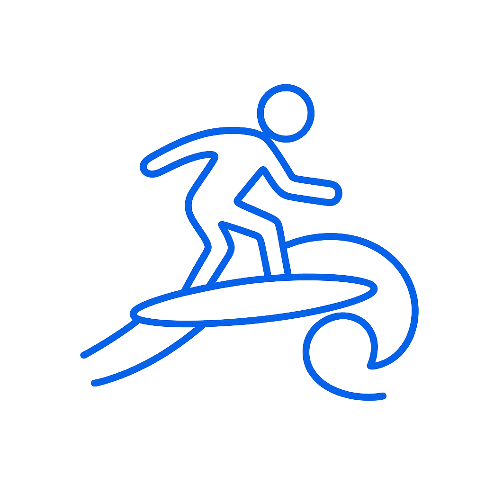

<div align="center">
  
  
  # SURF
  
  > **A modern, polished reimplementation of CustomCurve Pro — a Python Tkinter app for creating, editing, and testing custom mouse sensitivity curves.**  
  > Designed for precision, performance, and a clean dark UI.
</div>

<div align="center">
<p>
  <a href="https://github.com/awarzu/Surf/releases">
    
  </a>
  <a href="LICENSE">
    
  </a>
  <a href="https://github.com/awarzu/Surf/stargazers">
    
  </a>
  <a href="https://github.com/awarzu/Surf/graphs/contributors">
    
  </a>
  <a href="https://github.com/awarzu/Surf">
    
  </a>
  <a href="https://github.com/awarzu/Surf/releases">
    
  </a>
</p>
</div>

---

<div align="center">

## ⚠️ Anti-Cheat Compatibility Warning

<table>
<tr>
<td align="center" width="100%">

**Currently Incompatible:** 🚫 Valorant • 🚫 Apex Legends

Kernel-level anti-cheat systems detect SURF due to driver architecture limitations.  
**Do not use with these games to avoid potential bans.**

**Technical Issue:** Driver cannot currently read directional maps; requires LUT implementation rewrite.  
**Status:** Fix in development for next update.

</td>
</tr>
</table>

</div>

---

---

## Table of Contents

1. [Overview](#overview)
2. [Key Features](#key-features)
3. [Installation](#installation)
4. [Controls & Interactions](#controls--interactions-in-app)
5. [Testing Area](#testing-area)
6. [Profile Format (JSON)](#profile-format-json)
7. [Downloads](#downloads)
8. [Demonstration](#demonstration)
9. [Contributing](#contributing)
10. [License](#license)

---

## Overview

Surf recreates the best parts of CustomCurve Pro and adds modern UX touches: interactive curve editing, independent horizontal/vertical tuning, profile management, sandboxed testing canvas, bias multipliers, and a responsive dark theme — all in a single-file Python/Tkinter app.

---

## Key Features

* Input DPI & in-game sensitivity with instant preview
* Interactive curve editor (horizontal + vertical): add, move, remove control points

  * Add point: double-click
  * Remove point: right-click a point
  * Move point: hold left mouse and drag
  * Zoom: mouse wheel
  * Pan: middle mouse button + drag
* Curve bias sliders for independent horizontal/vertical multipliers (0.1x — 3.0x)
* Profile system: save/load JSON profiles, rename, delete, import/export via file dialog
* Import `.ccurve` files and convert/apply them instantly
* Sandboxed test canvas — visual, real-time mouse movement simulation and gain readouts (no system changes)
* Modern dark theme with responsive scaling compatible with Windows 10/11

---

## Installation

1. Download the latest release from the [Releases page](https://github.com/awarzu/Surf/releases)
2. Extract the package
3. Run the executable file directly — no manual setup required

```bash
git clone https://github.com/awarzu/Surf/releases/tag/v1.0.4r2
cd Surf
python surf.exe
```

---

## Controls & Interactions (in-app)

* Add point — Double-click on graph
* Delete point — Right-click an existing point
* Drag point — Left-click + drag
* Zoom — Mouse wheel over the graph
* Pan — Middle mouse (wheel) + drag
* Bias sliders — Adjust horizontal/vertical sensitivity curve multipliers
* Profile management — Use the profile panel to create, rename, delete, import, export

---

## Testing Area

The built-in test canvas simulates mouse movement with current curve + DPI + sensitivity settings, showing:

* Current gain (live numeric readout)
* Trajectory preview
* Option to reset the simulated pointer

This is intentionally sandboxed — Surf does **not** modify system mouse settings.

---

## Profile Format (JSON)

Example of a saved profile (pretty-printed):

```json
{
  "name": "my_profile",
  "dpi": 800,
  "sensitivity": 2.0,
  "horizontal": {
    "bias": 1.0,
    "points": [[0.0, 0.0], [0.5, 0.6], [1.0, 1.0]]
  },
  "vertical": {
    "bias": 1.0,
    "points": [[0.0, 0.0], [1.0, 1.0]]
  }
}
```

---

## Downloads

| Version         | Release Date | Windows                                                                                                                                                    | Linux       | Notes                                                                     |
| --------------- | ------------ | ---------------------------------------------------------------------------------------------------------------------------------------------------------- | ----------- | ------------------------------------------------------------------------- |
| v1.0.4 – Part 3 | 2025-10-05   | [](https://github.com/awarzu/Surf/releases/download/v1.0.4r2/Surf.exe) | Coming soon | [Release Notes](https://github.com/awarzu/Surf/releases/tag/v1.0.4r2)     |
| v1.0.4 – Part 2 | 2025-10-02   | [](https://github.com/awarzu/Surf/releases/download/v1.0.4r1/Surf.exe) | Coming soon | [Release Notes](https://github.com/awarzu/Surf/releases/tag/v1.0.4r1)     |
| v1.0.4 – Part 1 | 2025-09-28   | [](https://github.com/awarzu/Surf/releases/download/v1.0.4/Surf.exe)   | Coming soon | [Release Notes](https://github.com/awarzu/Surf/releases/tag/v1.0.4-part1) |
| v1.0.3p1        | 2025-09-19   | [](https://github.com/awarzu/Surf/releases/download/v1.0.3p1/Surf.exe) | Coming soon | [Release Notes](https://github.com/awarzu/Surf/releases/tag/v1.0.3p1)     |
| v1.0.3          | 2025-09-12   | [](https://github.com/awarzu/Surf/releases/download/v1.0.3/Surf.exe)   | Coming soon | [Release Notes](https://github.com/awarzu/Surf/releases/tag/v1.0.3)       |
| v1.0.2p3        | 2025-09-10   | [](https://github.com/awarzu/Surf/releases/download/v1.0.2p3/Surf.exe) | Coming soon | [Release Notes](https://github.com/awarzu/Surf/releases/tag/v1.0.2p3)     |
| v1.0.2p2        | 2025-09-10   | [](https://github.com/awarzu/Surf/releases/download/v1.0.2p2/Surf.exe) | Coming soon | [Release Notes](https://github.com/awarzu/Surf/releases/tag/v1.0.2p2)     |
| v1.0.2p1        | 2025-09-09   | [](https://github.com/awarzu/Surf/releases/download/v1.0.2p1/Surf.exe) | Coming soon | [Release Notes](https://github.com/awarzu/Surf/releases/tag/v1.0.2p1)     |
| v1.0.2          | last month   | [](https://github.com/awarzu/Surf/releases/download/v1.0.2/Surf.exe)   | Coming soon | [Release Notes](https://github.com/awarzu/Surf/releases/tag/v1.0.2)       |
| v1.0.1          | 2025-08-31   | [](https://github.com/awarzu/Surf/releases/download/v1.0.1/Surf.exe)   | Coming soon | [Release Notes](https://github.com/awarzu/Surf/releases/tag/v1.0.1)       |
| v1.0.0          | 2025-08-31   | [](https://github.com/awarzu/Surf/releases/download/v1.0.0/Surf.exe)   | Coming soon | [Release Notes](https://github.com/awarzu/Surf/releases/tag/v1.0.0)       |

---

## Demonstration

* Check the [Releases page](https://github.com/awarzu/Surf/releases) for usage notes and version highlights
* Read the feature breakdown above — it mirrors the actual workflow in the application
* User-shared profiles in Issues/Discussions can also serve as practical demonstrations

---

## Contributing

Since the repository currently contains only compiled releases, contributions can be made in the following ways:

* **Feedback** — Report bugs, unexpected behavior, or UI issues in the [Issues section](https://github.com/awarzu/Surf/issues)
* **Feature Requests** — Suggest improvements or new features via Issues
* **Profile Sharing** — Upload and share your custom profile configurations to help others
* **Testing** — Download releases, test across different systems, and report compatibility or performance issues

Pull requests with code changes are welcome once source files are available.

---

## License

This project is licensed under the MIT License. See the [LICENSE](LICENSE) file for details.

